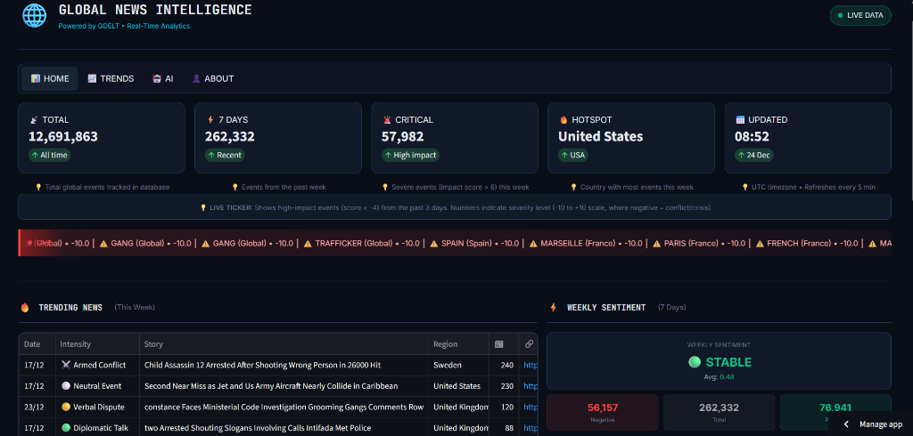
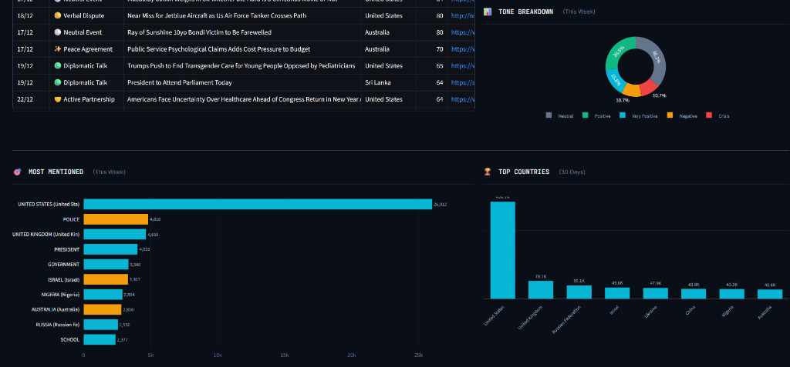
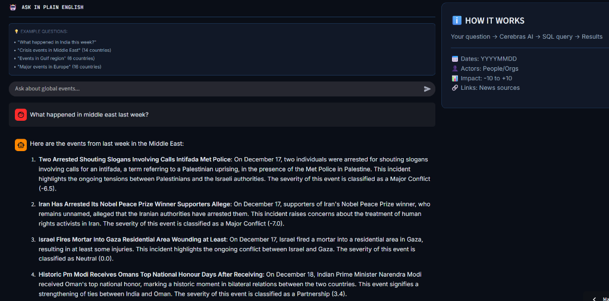
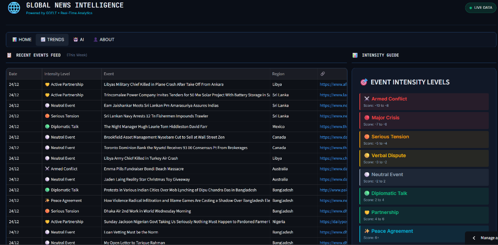

<p align="center">
  
  
  
  
  
  <a href="https://github.com/Mohith-akash/Global-News-Intel-Platform/actions"></a>
</p>


<h1 align="center">🌐 Global News Intelligence Platform</h1>

<p align="center">
  <strong>Global news analytics with GDELT + AI + modern data stack</strong>
</p>

<p align="center">
  <a href="https://global-news-intel-platform.streamlit.app/">
    
  </a>
</p>

<p align="center">
  <a href="https://global-news-intel-platform.streamlit.app/">Live Demo</a> •
  <a href="#-features">Features</a> •
  <a href="#%EF%B8%8F-architecture">Architecture</a> •
  <a href="#-tech-stack">Tech Stack</a> •
  <a href="#-quick-start">Quick Start</a> •
  <a href="#-cost-efficiency">Cost Efficiency</a>
</p>

---

## 🎯 Overview

A full-stack data engineering project that ingests, processes, and visualizes **100,000+ daily global news events** from the GDELT Project. Includes AI chat for natural language queries and a live analytics dashboard.

### 📊 By the Numbers
| Metric | Value |
|--------|-------|
| **Cumulative Events** | 12M+ processed |
| **Daily Ingestion** | 100K+ events/day |
| **Data History** | 3.5+ months live data |
| **Languages** | 100+ monitored |
| **Countries** | 200+ covered |
| **Query Speed** | <1 second |
| **Monthly Cost** | $0 |

### What is GDELT?
The [GDELT Project](https://www.gdeltproject.org/) monitors the world's news media from nearly every country in 100+ languages, identifying people, locations, themes, and emotions driving global society.

---

## 📸 Dashboard Preview

### Home - KPIs & Trending News


### Analytics - Actors & Countries


### AI Chat - Natural Language Queries


### Trends - Event Feed


---

## ✨ Features

| Feature | Description |
|---------|-------------|
| **📊 Real-Time Dashboard** | Live metrics, trending news, sentiment analysis, geographic distribution |
| **🤖 AI Chat Interface** | Ask questions in plain English → Get SQL-powered answers |
| **⚡ Automated Pipeline** | 30-minute refresh cycles via GitHub Actions + Dagster |
| **🌍 Global Coverage** | Events from 200+ countries with country code mapping |
| **📈 Trend Analysis** | 30-day time series, intensity tracking, actor monitoring |
| **🎨 Dark Mode UI** | Custom dark theme, responsive Plotly charts |

---

## 🏗️ Architecture

```
┌─────────────────┐     ┌──────────────────┐     ┌─────────────────┐
│   GDELT API     │────▶│ GitHub Actions   │────▶│    Dagster      │
│  (Raw Events)   │     │  (Scheduler)     │     │ (Orchestrator)  │
└─────────────────┘     └──────────────────┘     └────────┬────────┘
                                                          │
                                                          ▼
┌─────────────────┐     ┌──────────────────┐     ┌─────────────────┐
│   Streamlit     │◀────│   Cerebras AI    │◀────│   MotherDuck    │
│  (Dashboard)    │     │  (LLM Layer)     │     │   (DuckDB DWH)  │
└─────────────────┘     └──────────────────┘     └─────────────────┘
```

### Data Flow (ETL/ELT Pipeline)
1. **Extract**: GDELT API provides 15-minute update intervals
2. **Transform**: Headlines extracted, country codes mapped, scores normalized
3. **Load**: Deduplicated data inserted into MotherDuck (serverless DuckDB)
4. **Serve**: Streamlit dashboard with Plotly visualizations
5. **AI Query**: Dual mode AI chat:
   - **SQL Mode**: LlamaIndex Text-to-SQL → Cerebras LLM → SQL execution
   - **RAG Mode**: Voyage AI embeddings → MotherDuck vector search → Cerebras LLM

---

## 🛠️ Tech Stack

### Data Engineering
| Tool | Purpose | Replaces |
|------|---------|----------|
| **Dagster** | Pipeline orchestration with asset-based design | Apache Airflow |
| **DuckDB** | In-process OLAP database for fast analytics | Apache Spark |
| **MotherDuck** | Serverless cloud DuckDB warehouse | Snowflake/Redshift |
| **GitHub Actions** | CI/CD and scheduled pipeline execution | AWS Lambda |
| **SQL** | Data transformations in pipeline.py | dbt Cloud |
| **Pandas** | Data manipulation and processing | PySpark |

### AI/ML
| Tool | Purpose | Replaces |
|------|---------|----------|
| **Cerebras** | LLM inference (Llama 3.1 8B) | OpenAI GPT-4 |
| **LlamaIndex** | Text-to-SQL query engine | Custom NLP |
| **Voyage AI** | Vector embeddings for RAG | OpenAI Embeddings |
| **MotherDuck Vectors** | Native vector similarity search | Pinecone / Weaviate |

### Frontend
| Tool | Purpose | Replaces |
|------|---------|----------|
| **Streamlit** | Interactive dashboard framework | Tableau / Power BI |
| **Plotly** | Dynamic charts and visualizations | D3.js / Chart.js |

### Other Skills Demonstrated
- **Python** (Pandas, Requests, RegEx)
- **SQL** (Complex queries, aggregations, window functions)
- **ETL/ELT** (Extract, Transform, Load patterns)
- **API Integration** (REST, JSON parsing)
- **CI/CD** (GitHub Actions, cron scheduling)
- **Vector Search** (Embeddings, cosine similarity)

---

## 🚀 Quick Start

### Prerequisites
- Python 3.10+
- [MotherDuck Account](https://motherduck.com/) (free tier)
- [Cerebras API Key](https://cloud.cerebras.ai/) (free tier)

### Installation

```bash
# Clone the repository
git clone https://github.com/Mohith-akash/Global-News-Intel-Platform.git
cd Global-News-Intel-Platform

# Create virtual environment
python -m venv venv
source venv/bin/activate  # Linux/Mac
# or
.\venv\Scripts\activate   # Windows

# Install dependencies
pip install -r requirements.txt
```

### Configuration

Create a `.env` file in the project root:

```env
MOTHERDUCK_TOKEN=your_motherduck_token
CEREBRAS_API_KEY=your_cerebras_api_key
VOYAGE_API_KEY=your_voyage_api_key  # Optional: enables RAG mode
```

### Run the Dashboard

```bash
streamlit run app.py
```

### Run the Pipeline Manually

```bash
python -m dagster job execute -f etl/pipeline.py -j gdelt_ingestion_job
```

---

## 💰 Enterprise Tools vs My Stack

This project demonstrates how to achieve enterprise-grade capabilities at **zero cost**:

| Enterprise Tool | Monthly Cost | My Alternative | My Cost |
|-----------------|--------------|----------------|---------|
| **Databricks/Spark** | ~$500 | DuckDB | $0 |
| **Snowflake/BigQuery** | ~$300 | MotherDuck | $0 |
| **Managed Airflow** | ~$300 | Dagster + GitHub Actions | $0 |
| **dbt Cloud** | ~$100 | SQL in Python | $0 |
| **Pinecone/Weaviate** | ~$70 | MotherDuck Vectors | $0 |
| **OpenAI Embeddings** | ~$50 | Voyage AI | $0 |
| **OpenAI GPT-4** | ~$100 | Cerebras | $0 |
| **Tableau/Power BI** | ~$70 | Streamlit | $0 |
| **TOTAL** | **$1,490+** | | **$0** |

> **Key Insight**: MotherDuck's native vector search eliminates the need for a separate vector database like Pinecone.

---

## 🔄 Technology Evolution

This project evolved through multiple iterations to optimize for cost and performance:

### Data Warehouse
```
❄️ Snowflake (trial) → 🦆 MotherDuck (free tier)
```
- Started with Snowflake trial for learning enterprise DWH
- Migrated to MotherDuck to eliminate costs while keeping SQL compatibility

### AI/LLM Provider
```
✨ Gemini 2.0/2.5 Flash → ⚡ Groq (Llama 3.3 70B) → 🧠 Cerebras (Llama 3.1 8B)
```
- Tested Gemini models for natural language queries
- Tried Groq's fast inference with larger Llama models
- Settled on Cerebras for reliable free tier and good performance

### RAG Embeddings
```
🚀 Voyage AI (embeddings) + 🦆 MotherDuck (vector search)
```
- Voyage AI creates 1024-dim embeddings for semantic search
- MotherDuck's native `array_cosine_similarity()` replaces Pinecone
- Dual-mode AI: SQL for precise queries, RAG for semantic exploration

**Key Learning**: The best tool isn't always the most expensive—it's the one that solves your problem within constraints.

---

## 📁 Project Structure

```
gdelt_project/
├── app.py                # Streamlit dashboard entry point
├── src/                  # Core modules
│   ├── config.py         # Configuration constants
│   ├── database.py       # Database connection
│   ├── queries.py        # SQL query functions
│   ├── ai_engine.py      # LLM/AI setup (Cerebras + LlamaIndex)
│   ├── rag_engine.py     # RAG engine (Voyage AI + vector search)
│   ├── data_processing.py# Headline extraction
│   ├── utils.py          # Utility functions
│   └── styles.py         # CSS styling
├── etl/                  # Data pipeline
│   └── pipeline.py       # Dagster ETL pipeline
├── components/           # UI components
│   ├── render.py         # Dashboard rendering
│   ├── ai_chat.py        # AI chat interface
│   └── about.py          # About page
├── requirements.txt      # Python dependencies
├── .env                  # Environment variables (not in repo)
└── .github/
    └── workflows/
        └── hourly_update.yml  # GitHub Actions scheduler
```

---

## 🔮 Future Enhancements

- [ ] Add dbt transformations for advanced modeling
- [ ] Implement event clustering with ML
- [ ] Add email/Slack alerts for crisis events
- [ ] Expand AI chat with multi-turn conversations
- [ ] Add export functionality (CSV, PDF reports)

---

## 🤝 Contributing

Contributions are welcome! Please feel free to submit a Pull Request.

---

## 📬 Contact

**Mohith Akash**

[](https://github.com/Mohith-akash)
[](https://www.linkedin.com/in/mohith-akash/)

---

## 📄 License

This project is licensed under the MIT License - see the [LICENSE](LICENSE) file for details.

---

<p align="center">
  <sub>Built with ☕ and curiosity • Data sourced from <a href="https://www.gdeltproject.org/">GDELT Project</a></sub>
</p>
