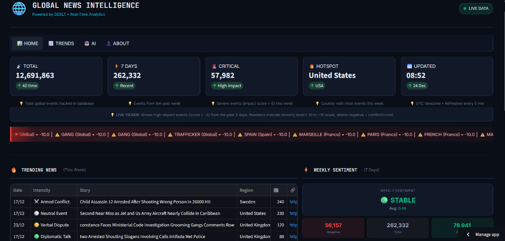
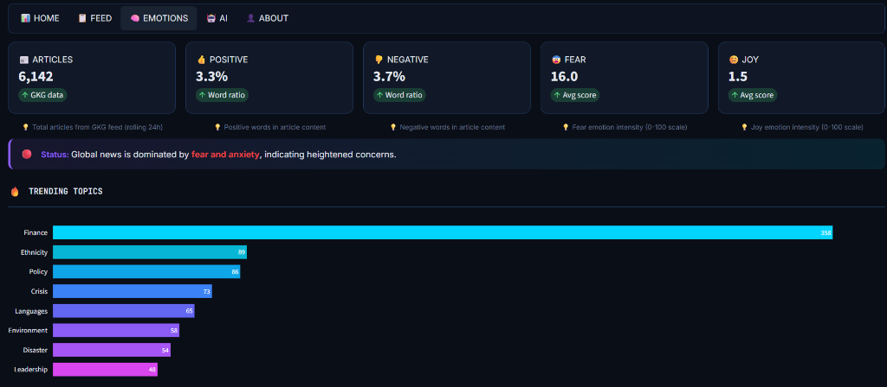
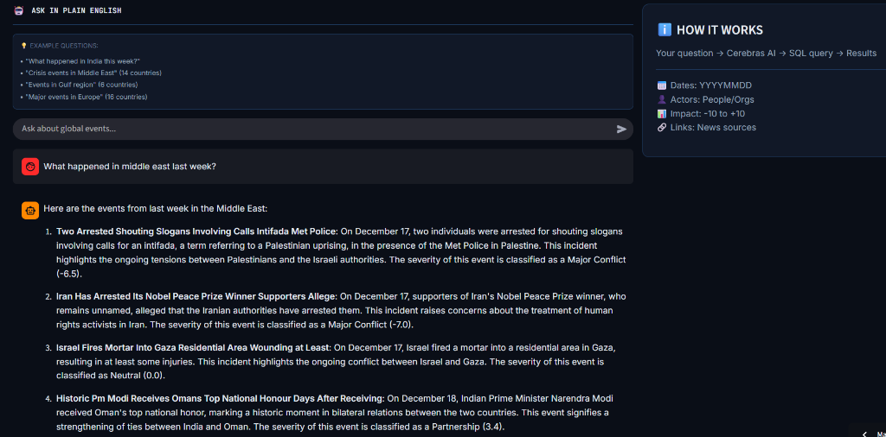
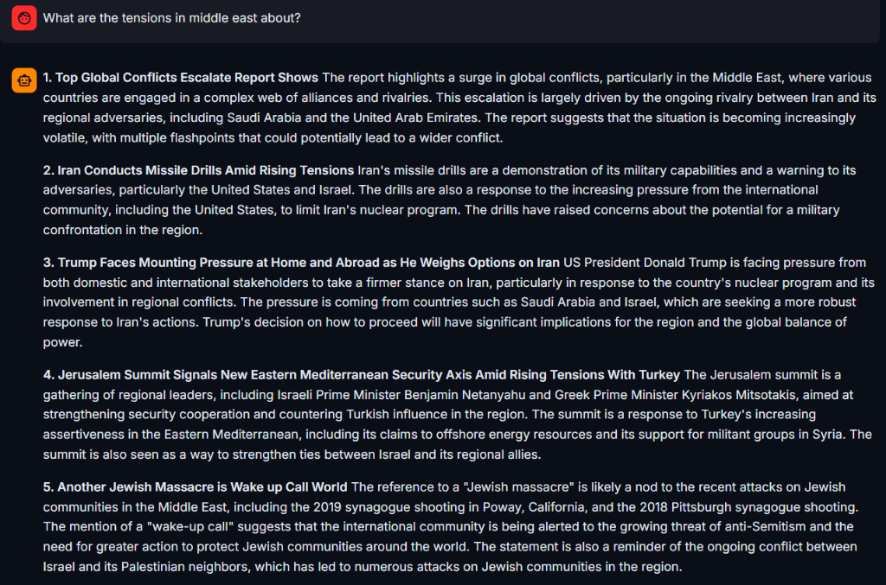

# Global News Intelligence Platform

[](https://github.com/Mohith-akash/Global-News-Intel-Platform/actions)

Serverless ELT pipeline that ingests, processes, and visualizes 100,000+ global news events per day from the [GDELT Project](https://www.gdeltproject.org/), with an AI chat interface for natural-language queries.

**Live dashboard:** https://global-news-intel-platform.streamlit.app/

| Metric | Value |
|--------|-------|
| Cumulative events processed | 20M+ |
| Daily ingestion | 100K+ events |
| Live operation | 8+ months, continuous scheduled runs |
| Unique visitors | 6,000+ in the first few months, 100+ new daily, no promotion |
| Coverage | 200+ countries, 100+ languages |
| Typical query latency | < 1 second |
| Monthly infrastructure cost | $0 |

GDELT monitors news media from nearly every country in 100+ languages, identifying the people, locations, themes, and emotions driving global society.

## Architecture

```
              ┌──────────────┐          ┌──────────────┐
              │ GDELT Events │          │  GDELT GKG   │
              └──────┬───────┘          └──────┬───────┘
                     │                         │
                     └────────────┬────────────┘
                                  ▼
┌─────────────────────────────────────────────────────────────────────────┐
│  INGESTION (hourly; each run re-pulls 5h of 15-min batches, dedup by ID) │
│  GitHub Actions → Dagster → Polars → schema/threshold validation         │
└─────────────────────────────────────────────────────────────────────────┘
                                  │
                                  ▼
┌─────────────────────────────────────────────────────────────────────────┐
│  TRANSFORMATION                                                          │
│  dbt Core: staging (stg_events) → marts (fct_daily, dim_actors, etc.)    │
└─────────────────────────────────────────────────────────────────────────┘
                                  │
                                  ▼
┌─────────────────────────────────────────────────────────────────────────┐
│  STORAGE & AI                                                            │
│  MotherDuck (DWH) ← Voyage AI (embeddings) → Cerebras LLM (RAG/SQL)      │
│  └── gkg_emotions: fear, joy, tone, topics                               │
└─────────────────────────────────────────────────────────────────────────┘
                                  │
                                  ▼
┌─────────────────────────────────────────────────────────────────────────┐
│  PRESENTATION                                                            │
│  Streamlit: Home | Feed | Emotions | AI Chat | About                     │
└─────────────────────────────────────────────────────────────────────────┘
```

### Data flow

1. **Extract:** GDELT Events API + GKG feed, parsed with Polars
2. **Validate:** schema and threshold checks before anything is written
3. **Load:** deduplicated inserts into MotherDuck (serverless DuckDB)
4. **Transform:** dbt models build staging views and mart tables
5. **Emotions:** GKG tone/fear/joy/topics extracted on a rolling 24h window
6. **Embed:** Voyage AI generates 1024-dim vectors every 12 hours
7. **Serve:** Streamlit dashboard with dual-mode AI chat (SQL + RAG)

### Cost engineering

The pipeline started on a Snowflake trial. When the trial ended, the warehouse moved to MotherDuck and the slowest processing stage was rewritten from Pandas to Polars (~10x faster), bringing the total monthly cost to $0 on free tiers, without giving up SQL compatibility, orchestration, testing, or vector search. MotherDuck's native `array_cosine_similarity()` also removed the need for a separate vector database.

Other decisions that changed along the way: the LLM provider went from Gemini to Groq to Cerebras (reliable free tier, fast inference; currently GPT-OSS 120B after Cerebras archived Llama 3.1).

## Features

| Feature | Description |
|---------|-------------|
| Real-time dashboard | Live metrics, trending news, sentiment, geographic distribution |
| Emotion analytics | GKG-powered tracking: fear, joy, positive/negative, global mood index |
| AI chat | Plain-English questions answered via generated SQL or RAG |
| LLM headline repair | Cerebras batch job fixes slug-derived headlines (casing, keyword stuffing) with hallucination guards |
| Hourly updates | External cron trigger → GitHub Actions → Dagster job |
| Data quality gates | Custom schema + threshold validation before load |
| Trend analysis | 30-day time series, intensity tracking, actor monitoring |

## Screenshots

**Home: KPIs and trending news**



**Emotions: GKG mood analysis**



**AI chat: natural-language queries**



**RAG chat: semantic analysis of world events**



## Tech stack

| Layer | Tool | Role |
|-------|------|------|
| Processing | Polars | DataFrame processing (replaced Pandas in the hot path) |
| Transformation | dbt Core | Staging/marts models, schema tests |
| Validation | Custom validator | Schema + threshold checks at ingestion |
| Orchestration | Dagster | Asset-based pipeline definitions |
| Scheduling | GitHub Actions | hourly ingestion, 12-hour embeddings, health monitor |
| Warehouse | MotherDuck (DuckDB) | Serverless OLAP storage + native vector search |
| LLM | Cerebras (GPT-OSS 120B) | Text-to-SQL and RAG answers via LlamaIndex |
| Embeddings | Voyage AI | 1024-dim vectors for semantic search |
| Frontend | Streamlit + Plotly | Dashboard and charts |

## Quick start

Requires Python 3.10+, a free [MotherDuck](https://motherduck.com/) account, and a free [Cerebras](https://cloud.cerebras.ai/) API key.

```bash
git clone https://github.com/Mohith-akash/Global-News-Intel-Platform.git
cd Global-News-Intel-Platform

python -m venv venv
source venv/bin/activate        # Windows: .\venv\Scripts\activate
pip install -r requirements.txt
```

Create a `.env` file in the project root:

```env
MOTHERDUCK_TOKEN=your_motherduck_token
CEREBRAS_API_KEY=your_cerebras_api_key
VOYAGE_API_KEY=your_voyage_api_key   # optional: enables RAG mode
```

Run the dashboard:

```bash
streamlit run app.py
```

Run the pipeline manually:

```bash
# Ingestion (normally triggered hourly)
python -m dagster job execute -f etl/pipeline_polars.py -j gdelt_ingestion_job

# Embedding generation (normally every 12 hours)
python -m dagster job execute -f etl/embedding_job.py -j gdelt_embedding_job

# dbt models
cd dbt && dbt run
```

## Project structure

```
gdelt_project/
├── app.py                    # Streamlit dashboard entry point
├── src/
│   ├── config.py             # Configuration constants
│   ├── database.py           # Database connection
│   ├── queries.py            # SQL query functions
│   ├── ai_engine.py          # LLM setup (Cerebras + LlamaIndex)
│   ├── rag_engine.py         # RAG engine (Voyage AI + vector search)
│   ├── data_processing.py    # Headline extraction
│   ├── utils.py              # Utility functions
│   └── styles.py             # CSS styling
├── etl/
│   ├── pipeline_polars.py    # Polars ingestion + validation (Dagster)
│   ├── embedding_job.py      # 12-hour embedding generation
│   └── headline_polish_job.py# 12-hour LLM headline repair (Cerebras)
├── dbt/
│   ├── dbt_project.yml
│   ├── profiles.yml          # MotherDuck connection
│   └── models/
│       ├── staging/          # stg_events, stg_gkg_emotions
│       └── marts/            # fct_daily_events, dim_actors, dim_countries, ...
├── components/               # Streamlit UI components
└── .github/workflows/
    ├── gdelt_ingest.yml          # hourly ingestion
    ├── gdelt_embeddings_12hr.yml # 12-hour embedding job
    └── health_monitor.yml        # Uptime checks + ntfy alerts
```

## License

MIT license, see [LICENSE](LICENSE).

Data sourced from the [GDELT Project](https://www.gdeltproject.org/). Built by [Mohith Akash](https://github.com/Mohith-akash) · [LinkedIn](https://www.linkedin.com/in/mohith-akash/)
